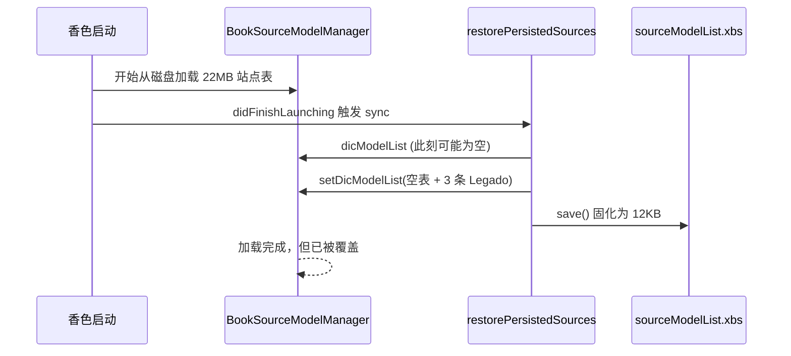

# 双源共存到终局执行计划

## 一、现状与核心缺口

终局口径三处一致（计划 §一、进度板 §终局口径、memory `香色Legado最终目的`），无需修订。但硬目标「XBS 与 Legado 同时正常」从未在真机验证过：

- 注入包当前是 `站点(3)`，全是 Legado 源；原生 XBS 侧为空
- 进度板把 F3 记为「策略闭合：全量 aside」，实际是把问题旁路了，不是解决了
- 全量数据未丢：`Library/appdata/sourceModelList.xbs.full_22m_aside`（22659944 字节）仍在，不必从 SR0 拉

### 恢复前必须先堵的落盘缺口

[NativeSourceInjector.swift](D:\soft\xiangse\LegadoBridge\Sources\LegadoBridge\Bridge\NativeSourceInjector.swift) 的 `mergeModelsIntoManager` 读底表时 `let current = (raw as? NSDictionary) ?? [:]`，底表为空也照常 `setDicModelList` + `invokeSave`。而 [LegadoBridgeCore.swift](D:\soft\xiangse\LegadoBridge\Sources\LegadoBridge\Bridge\LegadoBridgeCore.swift) 的 `restorePersistedSources` 在 `didFinishLaunching` 就触发 sync。

`replace=true` 已被硬禁，但这条竞态路径能达成同样结果。**先恢复数据再改代码，等于当场再吞一次。**

### 只有恢复 960 站后才暴露的第二个问题

`isLegadoSourceName` 仅按 `bookSourceName` 匹配 Registry。现有三个 Legado 源含「笔趣读」，960 个 XBS 里同名站点概率不低。重名后果：
- `mergeModelsIntoManager` 的 `merged[name] = entry` 覆盖掉同名 XBS 条目
- 列表点击、`sourceType*` Hook 把真 XBS 站当 Legado，拦进 Bridge 管理页

---

## 二、阶段 D：双源共存（U0 收尾，U1 前置门禁）

### D0 落盘守卫（改代码，必须先于恢复数据）

改 `NativeSourceInjector.swift`：

1. 底表水位持久化：在 `Documents/legado_native_table_hwm.txt` 记录历史见过的最大 `dicModelList` 条目数
2. `mergeModelsIntoManager` 增加拒写条件——`current.count == 0`，或 `current.count < 水位 / 2`，则不 `setDicModelList`、不 `invokeSave`，写标记 `SKIP_UNSAFE_BASE` 并返回 false
3. `invokeSave` 只在 merge 返回 true 时调用（现在是无条件调）
4. 冷启动延后：`restorePersistedSources` 里的 sync 改为等原生表就绪后再执行（轮询 `dicModelList.count` 连续两次稳定且非零，或超时后放弃 sync 而非带空表 save）
5. 同名消歧：merge 写入前，若 `merged[name]` 已存在且不带 `legadoBridge=1` 标记，判为 XBS 同名，改用带后缀的键（或跳过并记冲突清单到 `Documents/legado_name_conflicts.txt`），不得覆盖

### D1 与 N06 深链合并成一次 CI

父聊已改好 [LBImportHooks.m](D:\soft\xiangse\LegadoBridge\Sources\LegadoBridgeHooks\LBImportHooks.m) 的 `legado://nativeOpenFile?path=`，尚未提交。D0 与它一起走一个 commit、一次 CI、一次装包，省一轮往返。

### D2 恢复 XBS 全量

装新包后（`.test_tools/` 下新脚本，参考 `fixtures/_devkit/restore_sites/trim_to_few.py` 的反向操作）：

1. `kill_app` 注入包
2. 备份当前 12KB 主文件
3. `cp sourceModelList.xbs.full_22m_aside → sourceModelList.xbs`
4. 冷启动，立刻读 `Documents/legado_native_sync.txt` 与 `legado_native_merge.txt`
5. **硬判据**：冷启后 `sourceModelList.xbs` 仍约 22MB。若掉回 KB 级，D0 守卫失效，回退重做

### D3 冷启动竞态压测

连续冷启 5 次，每次记录文件大小与 `站点(N)`。全部保持 22MB 且 N 稳定才算过。这一项专治 D0 想堵的竞态，不能省。

### D4 双源功能验收（不只看数字）

站点数对上只是必要条件。逐项留证：

- 站点管理显示 `站点(96x)`，列表里同时能看到原生 XBS 站与三个 Legado 源
- 取一个 XBS 源：搜索出结果 → 进详情 → 目录 → 正文上屏
- 取一个 Legado 源：同样四步走通
- 混合搜索一个词，结果里两侧来源都有（看 `legadoBridge` 标记分布）
- 检测站点抽样跑（不全跑 960）
- 读 `legado_name_conflicts.txt`，有冲突则按 D0 第 5 条处理后复测
- 全程 Legado 源不消失、XBS 源不消失

D4 全过后，F3 从「策略闭合」改判 PASS，并在进度板写明日常测试面仍可切回三源（切换脚本保留）。

---

## 三、U0 其余收尾

- N06：新包装机后跑 `.test_tools/verify_u0_n06_deeplink.py`，验 `legado://nativeOpenFile?path=` 能触发 openURL 并把 TXT 读进书架
- N10 TTS：维持 PENDING，按计划 §二例外清单不开发，进度板写明理由
- F5 / N03 / N11 三项 PASS_ENTRY：判断是否需要升级为完整 PASS，还是接受入口级证据（N11 无账号夹具，建议维持）

---

## 四、U1 / U2 / U3（原生 UI 接管）

按计划 §12.2 顺序，一项一循环：取证 → 开发 → CI → 真机门禁 → 回归。

- **U1 目录/详情**：`LBLegadoCatalogListVC` → 原版 `BookDetail*`/Catalog 链。开工前先做原版 TXT 书目录链同相位差分 dump（§12.3 第 5 条）。撞私有生命周期立即回退桥接页
- **U2 书源管理**：`LBLegadoSourceManagerVC` → 原版站点管理承载。D0 的同名消歧和存储隔离设计是这一项的前置，D 阶段做完 U2 的风险面小很多
- **U3 导入 UI**：UIAlert → 原版导入入口。需先取证宿主 VC/私有入口；`ConfigSourceModelSyncCon`（原生「导入站点」）是候选

每项真机门禁须含与本地书同流程截图对拍。

---

## 五、门禁口径修订

进度板 [stage7-u0-native-compat-progress.md](D:\soft\xiangse\analysis\reader-forensics\stage7-u0-native-compat-progress.md) 需要改两处：

- F3 行从「策略闭合」改为待 D 阶段验收，写清楚「双源共存未实测」
- §门禁 增加一条：D4 未过不得开 U1（与现有「U0 未全 PASS 禁止 U1」并列）

第 68 行「禁止当测试面恢复 900 站」保留，但补一句：双源终验期间显式破例，验完可切回三源测试面。

---

## 六、风险与回退

- D2 覆盖前必须备份当前主文件，aside 保持原样不动
- 若 D0 守卫导致 Legado 源在冷启后不出现在站点管理（因为跳过了 sync），属于预期内的保守失败，改为延后重试而不是放开 save
- 若 22MB 表加载让启动明显变慢，记录数据后再决定是否需要日常/验收两套测试面
- 恢复全量后 MCP UI 自动化会变慢（960 行列表），脚本里的等待时间要放宽
