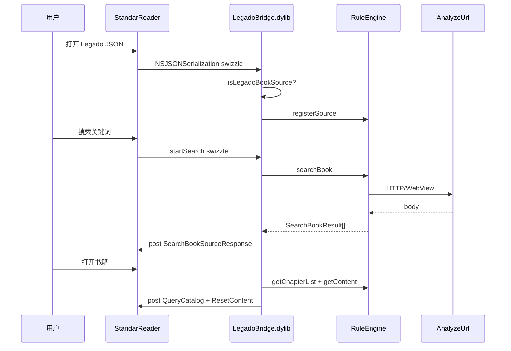
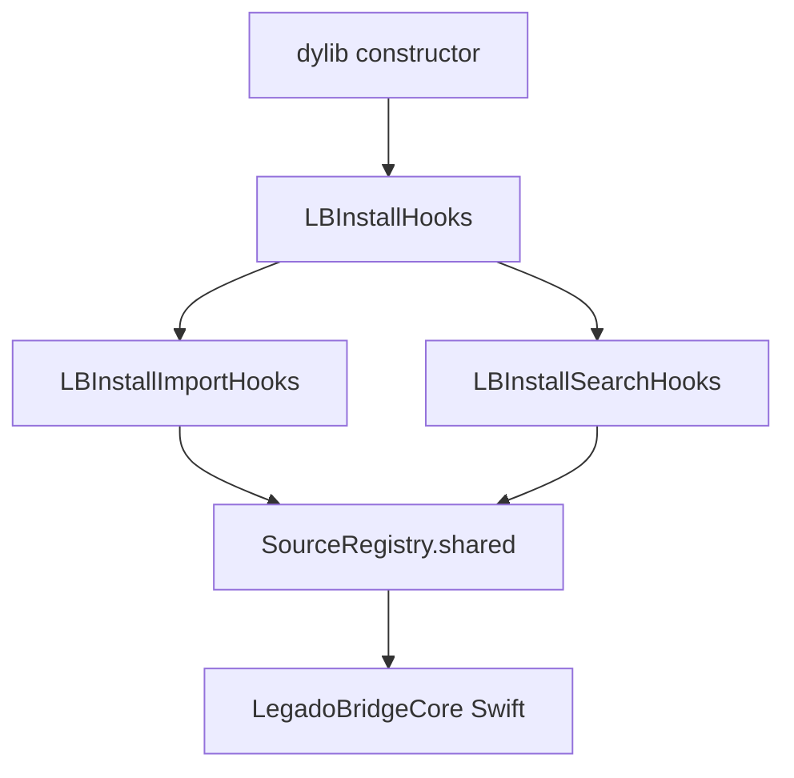

# Hook 映射表 — 香色闺阁 2.56.1

> MVP 目标：Legado JSON 导入 → 搜索 → 目录 → 第一章正文

## 架构总览



## Hook #1 — 书源导入

### 目标

拦截 Legado `.json` 书源导入，**不走** `queryXbsFile` / XBS 解密路径。

### 锚点

| 类型 | 符号 | 策略 |
|------|------|------|
| 方法 | `queryXbsFile` | fishhook / 运行时符号查找，Legado JSON 时短路返回 |
| 方法 | `findXbsLink` | 同上，识别 `.json` URL |
| 类方法 | `+[NSJSONSerialization JSONObjectWithData:options:error:]` | **主 Hook**：解析后检测 Legado schema |
| 类 | `BookSourceModelManager` | 导入完成后注入 Legado 源到并行注册表 |
| 通知 | `dNotifyName_UpdateBookSourceModelList` | 导入后刷新 UI 列表 |

### Legado 识别规则

```json
{
  "bookSourceUrl": "https://...",
  "bookSourceName": "...",
  "searchUrl": "..." 
}
```

或数组 `[{ ... }, { ... }]`。必须含 `bookSourceUrl` + (`searchUrl` 或 `ruleSearch`)。

### 实现方式

`+[NSJSONSerialization JSONObjectWithData:options:error:]` 类方法 Hook 采用「保存原 IMP + `method_setImplementation`」模式，**不使用 selector 交换**。

> 历史教训：早期版本用 `method_exchangeImplementations` 交换 `JSONObjectWithData:options:error:` 与 `lb_JSONObjectWithData:options:error:`，但 `lb_JSONObjectWithData:` 这个 selector 从未通过 `class_addMethod` 注册到 `NSJSONSerialization` 元类。交换后 hook 内部 `[self lb_JSONObjectWithData:...]`（`self` 为 `NSJSONSerialization`）在目标类表找不到该 selector，触发 `___forwarding___` → `doesNotRecognizeSelector` → `NSInvalidArgumentException` → `abort()`，导致冷启动 `SIGABRT`（11:18 连续 5 次秒级崩溃，异常 reason：`+[NSJSONSerialization lb_JSONObjectWithData:options:error:]: unrecognized selector sent to class`）。

当前实现：`method_getImplementation` 取出原 IMP 存入 `LBOrig_NSJSONSerialization_JSONObjectWithData`，`method_setImplementation` 替换为新 C 函数 `LBNSJSONSerialization_JSONObjectWithData_IMP`；hook 内直接调用原 IMP 指针，不依赖任何 selector 在目标类表中的存在性。

### 实现文件

- `LegadoBridge/Sources/LegadoBridgeHooks/LBSwizzle.m`（`LBInstallImportHooks`）
- `LegadoBridge/Sources/LegadoBridge/SourceRegistry.swift`

## Hook #2 — 搜索

### 目标

当活跃书源为 Legado 注册源时，用 Legado RuleEngine 执行 `searchBook`，结果注入香色闺阁搜索 UI。

### 锚点

| 类型 | 符号 | 策略 |
|------|------|------|
| 方法 | `startSearch:prioritySourceType:fromShuping:quick:` | Swizzle，Legado 源时转发 |
| 方法 | `onSearchBookSourceResponse:` | 注入合成响应 |
| 通知 | `dNotifyName_SearchBookSourceResponse` | 主注入通道 |
| 字符串 | `locallinkSearchBook://` | 本地搜索深链（备用入口） |

### 输出适配（XiangseAdapter）

香色闺阁 `SearchBook` 字段映射：

| Legado | 香色闺阁键 |
|--------|-----------|
| `name` | `name` / `bookName` |
| `author` | `author` |
| `bookUrl` | `bookUrl` / `url` |
| `coverUrl` | `coverUrl` |
| `intro` | `intro` |
| `kind` | `kind` / `type` |
| `lastChapter` | `lastChapterTitle` |
| `sourceUrl` | `sourceUrl`（Legado 扩展标记 `legadoBridge=1`） |

### 实现文件

- `LegadoBridge/Sources/LegadoBridgeHooks/LBSwizzle.m`（`LBInstallSearchHooks`）
- `LegadoBridge/Sources/LegadoBridge/XiangseAdapter.swift`
- `LegadoBridge/Sources/LegadoBridge/Bridge/LegadoBridgeCore.swift`

## Hook #3 — 目录

### 锚点

| 类型 | 符号 | 策略 |
|------|------|------|
| 通知 | `dNotifyName_QueryCatalogResponse` | 注入章节目录 |
| 方法 | `loadMoreChapter` | 分页目录（Phase 5） |
| 类 | `CatalogByBook` | 目录数据模型参考 |

### 输出

```objc
@[
  @{@"title": @"第一章", @"url": @"...", @"index": @0},
  ...
]
```

## Hook #4 — 正文

### 锚点

| 类型 | 符号 | 策略 |
|------|------|------|
| 通知 | `dNotifyName_ReadView_ResetContent` | 注入 HTML/文本正文 |
| 通知 | `dNotifyName_ReadView_FilterContent` | 替换规则后内容 |
| 字符串 | `chapterContent` | 规则字段名对齐 |

### 实现

`BridgeEngine.getChapterContent(sourceId, chapterUrl)` → `WebBook.getContent` 等价逻辑。

## 运行时注册流程



## 风险与 Fallback

| 场景 | Fallback |
|------|----------|
| 类名被 strip | `objc_getClass` + 前缀模糊匹配 `BookSource%` |
| Swizzle 失败 | URL Scheme `com.appbox.StandarReader://legado-import?url=` |
| JS 桥缺口 | 记录 `docs/java-api-gaps.md`，回流 legado-ios 修复 |

## 版本锁定

本映射**仅适用于** StandarReader **2.56.1**。其他版本需重新逆向验证符号。
